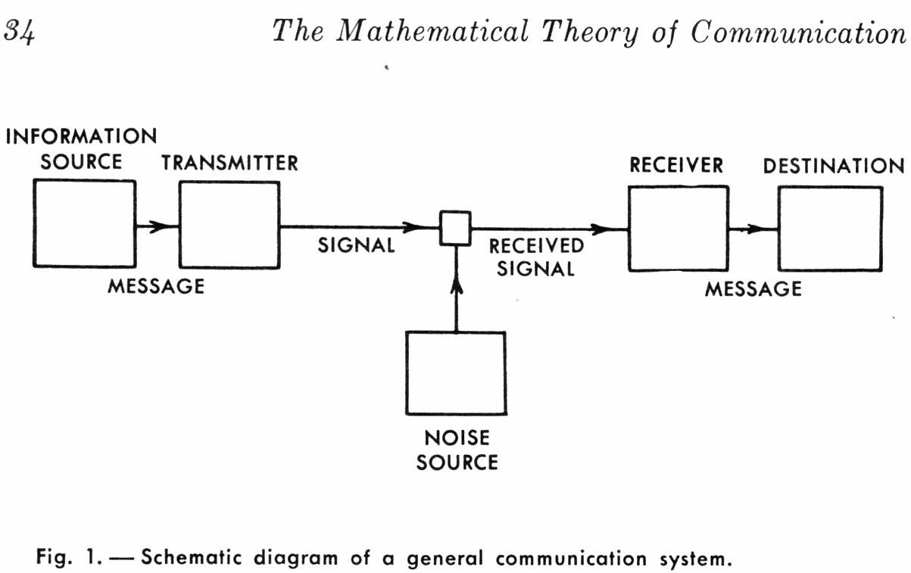

__Claude Shannon__ (1916-2001)
- 1937, MIT EE master thesis "A symbolic analysis of relay and switching circuits", introduce Boolean algebra to logic circuits.
- 1948, Bell Lab, "A mathematical theory of communication".
    - Shannon theorems, the coding theorem: "If the information rate of a given source does not exceed the capacity of a given channel, then there exist a coding technique that makes possible transmission through this unreliable channel with an arbitrarily low error rate.".

_Shannon’s view, was that if the recipient knows that a sine wave of a given frequency is to be communicated, why not simply regenerate it at the output rather than send it over a long distance? Or, if the recipient knows that a sine wave of unknown frequency is to be communicated, why not simply send the frequency rather than the entire waveform?_

# Probabilistic basis
- _Events_ are subsets of outcomes. Event defines probability.
- 0 &le; P(A) &le; 1
- P(A+B) = P(A) + P(B) if A and B are mutually exclusive, i.e. P(AB) = 0.
- P(A+B) = P(A) + P(B) - P(AB)
- Independent events: P(AB) = P(A)P(B)
- Conditional probability: P(A|B) = P(AB)/P(B)
- Expected value: probability weighted average.

# Information basis
- A communication system arm to transmit information from source to receiver. Each message conveys some information; some information conveys more information than other.
- Information theory is concerned with the fundamental limits of communication.
    - What is the ultimate limit to data compression?
    - How many bits can be sent per second over a channel?
- Information theory tries to analysis communication between a transmitter and receiver through an unreliable channel.
    - the amount of information produced by a given source
- The amount of information is the time of the message transmission, larger information spend more time to transfer.
- The amount of information depends on the probability of occurrence of the event (not depends on its contain).

       EX: 
       - The sum will rise in east tomorrow.
       - It will rain tomorrow.
        
### Information from intuitive point of view:

If I is the amount of information of a message m and P is the probability of occurrence of that event then mathematically, 

__I = 0; if P = 1,__  
__I = &infin;; if P = 0__

To hold above relation, the relation between I and P will be,

__I = log2(1/P)__   	

In information theory base of the logarithmic function is 2.

If communication source generate messages m1, m2, m3, ..., mk with probability of occurrence P1, P2, P3, ..., Pk, and if the probability of messages are independent, then the probability of the composite message is

__P = P1P2P3...Pk__

The information carried by the composite message is

__I = log2(1/P)__  
   __= log2(1/(P1P2P3...Pk))__  
   __= log2(1/P1) + log2(1/P2) + ... + log2(1/Pk)__  
   __= I1 + I2 + ... + Ik__

The information __I__ is inverse to the probability __P__, less probability produce more information.

### Information from engineering view:

The amount of information in a message is proportional to the time required to transmit the message. 

Therefore the message with smaller probability of occurrence needs long code word and that of larger probability need shorter codeword. 

The more efficient communication system need to transmit more messages in a range of time (if the channel capacity _bits/sec_ is fixed), then we need to encode the message as less as possible. I.e. more probability event use smaller codeword; less probability event use larger codeword. More probability event has less information; less probability have more information.

__Central idea of information theory is that messages of a source has to be coded in such a way that maximum amount of information can be transmitted through the channel of limited capacity.__

## Entropy
- Average information
__H = &Sigma;{i=1..k} Pilog2(1/Pi)__

EX:  
Let an information source can generate messages (alphabet or word) _m1, m2,..., mk_ with probability of occurrences _p1, p2,..., pk_. If there were send _L_ messages (sentence) in a duration of time, therefore the number of symbols of _m1, m2,..., mk_ are _Lp1, Lp2,..., Lpk_.  

Now the total information of _m1, m2,..., mk_ is  
_IT = Lp1log(1/p1) + Lp2log(1/p2) + ... + Lpklog(1/pk)_  
  _= &Sigma;{i=1..k} Lpilog(1/pi)_  

So the average information (H) is  
__H = IT/L = &Sigma;{i=1..k} Pilog2(1/Pi)__

__Question 1:__

An information source generates four messages m1, m2, m3 and m4 with probabilities of 1/2, 1/8, 1/8 and 1/4 respectively. Determine entropy of the system.

> Ans:
>
> H = (1/2)log2(2) + (1/8)log2(8) + (1/8)log2(8) + (1/4)log2(4)  
>  = 1/2 + 3/8 +3/8 + 1/2  
>  = 7/4 (bits/message).

__Question 2: (Homework, due date: 9/25)__

Determine the entropy of above example (question 1), if the probability of above messages (in question 1) are equally.

## Information Rate
- Average entropy per symbol (bits/sec)
- Needs how many bits to transmit a message (a number of symbols)

__R = symbol rate (message/sec) * entropy__

__Question 3:__

There are 256 possible messages which have the same occurrence probability, and the system symbol rate is 8KHz (8 * 103). What is the information rate?
 
> Ans:
>
> Entropy (H) = 256 * (1/256) * log2(256) = 8 (bits/sample)  
> Information Rate (R) = 8 * 103 = 64 * 103 (bits/sec) = 64Kbps.

__Question 4:__

We want to send a 1000 messages which only contain 4 sympols (m1, m2, m3, m4), if the probability of m1, m2, m3 and m4 are as described in Q1, i.e. the entropy is 7/4 = 1.75 bits, then 1000 messages needs 1750 bits.

If the probability of m1, m2, m3 and m4 are euqally (as Q2), then how much bits we need to transmit this 1000 messages?

We will see different information rate for the same message which has different entropy.
