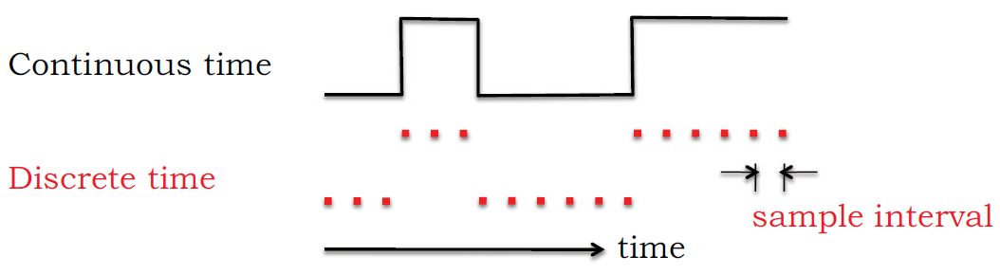
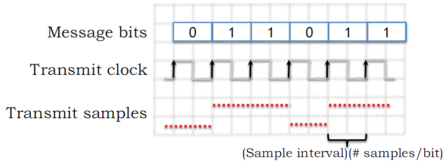

# Communication Network Abstrication

__Packets -> Bits -> Signals -> Bits -> Packets__

# Analog signal is nature
- Transmitting over a wire, we can send dignal at different voltage levels, and the receiver can measure the voltage to determine what the sender transmitted.   EX:
    - Black-and-white analog TV use the voltage waveform to represt the shade of gray of the picture.
    - Analog phone convert sound wave to electrical signal and back.
- Transmitting over an optical communication link, we can send signal in different intensities and/or wavelength.

# But digital is better for communication
- Easy to modularize and build large system.
- Digital data processing technique can improve the quality and performance of the system.

# There is no error-free communication channel
- tolerance of internal components
- environmental factors: temperature, power supply votlage
- interference from other transmissions

# Map Bits to Signals
- Voltage __V0__ for bit __0__; __V1__ for bit __1__.
- The bigger range of input voltage, or the longer period of time that voltage hold, the bigger tolerance of uncertainty.
- The boundary between __0__ and __1__ ((V0+V1)/2) calls the _threshold voltage_, __Vth__.
- The receiver can output any value when the input voltage is in the 'range' of __Vth__.

# Sender and Receiver synchronization
- The peer of sender and receiver need to aggree the same ___sample rate___ and ___clock rate___ in communication.
- Both the sender and receiver use its internal clock to determine when to generate or acquire the next voltage sample. And both use counters to keep track of how many samples there are in each bit.  
- If their clock don't exactly match, for example, the sender sending 5 samples per bit, but receiver's clock is a little slower, the receiver will seems to be transmitting faster, it may receive 4.999 samples per bit. Similarly, if receiver's clock is a little faster, the sender will seems to be transmitting slower, e.g., transmite at 5.001 samples per bit.
- __Sample Rate__: The number of samples per second.
- __Clock Rate__: The number of clock cycle per second __(Hz)__.
   

# Channel Capacity
Channel Capacity is defined as the maximum amount information a channel can convey per unit time. 

## Data Rate Limits
The maximum data rate limit over a medium is decided by followinf factors:
- Bandwidth of channel
- Signal levels
- Channel quality (level of noise)

## Shannon Capacity (Noisy Channel)
__C = BW * log2(1+S/N)__

where:
- C: Channel capacity (bits per second)
- BW: Bandwidth of channel
- S/N: signal to noise ratio
