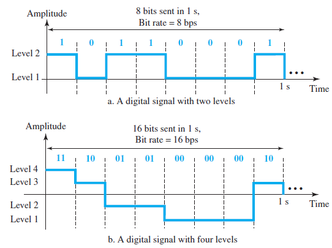
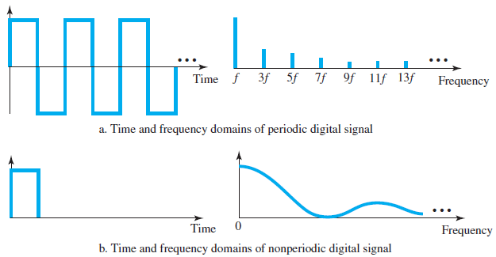

# Digital Signal

- most digital signals are ___nonperiodic___, so __periodic__ and __frequency__ are not appropriate characteristics.
- __Bit rate__ is the number of bits in 1 second (bps).
  > EX:  
  > HDTV - 1920x1080 pixels a picture, 24 bits colors per pixcel, and 30 frames per second.  
  > The bit rate is 1920 x 1080 x 30 x 24 &asymp; 1.5 Gbps
- __Bit length__ is the distance one bit occupies on the transmission medium. (The concept of __wavelength__ in analog signals)

## Time and Frequency Domain of Periodic and Nonperiodic Digital Signals

- A digital signal is a composite analog signal with an infinite bandwidth.
